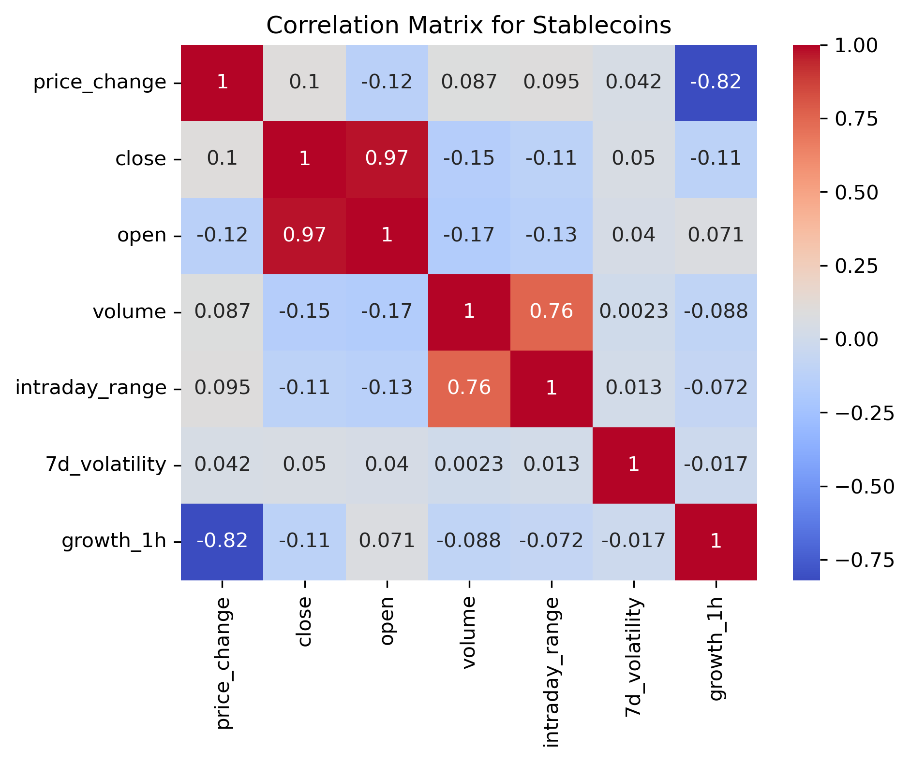
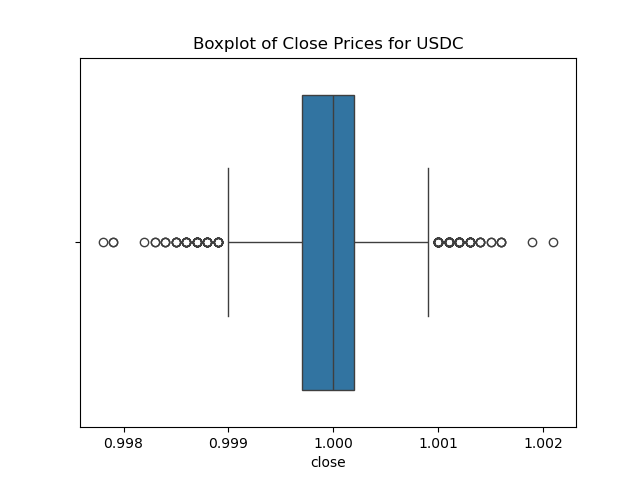
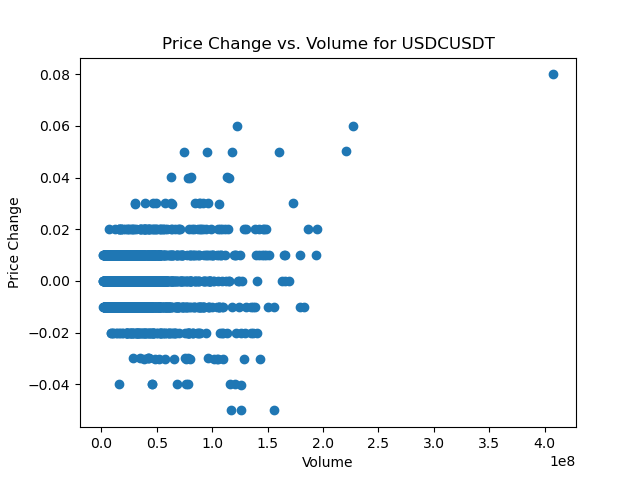
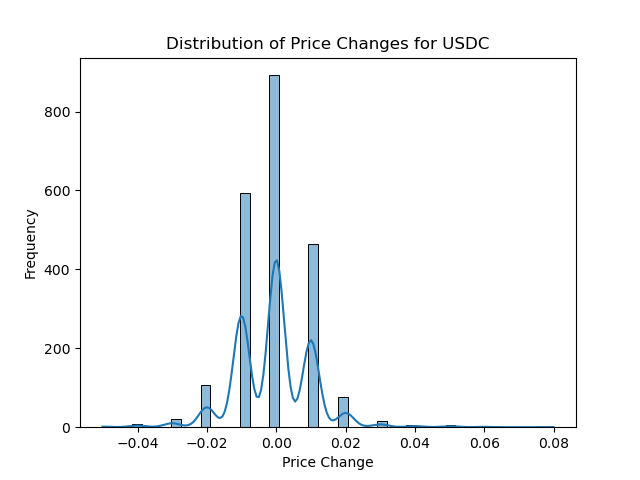
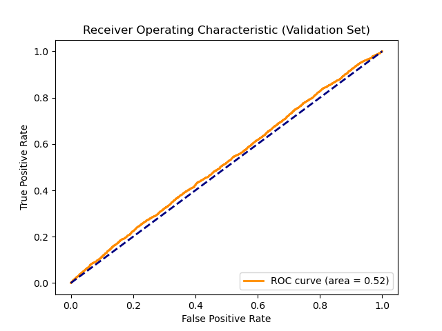
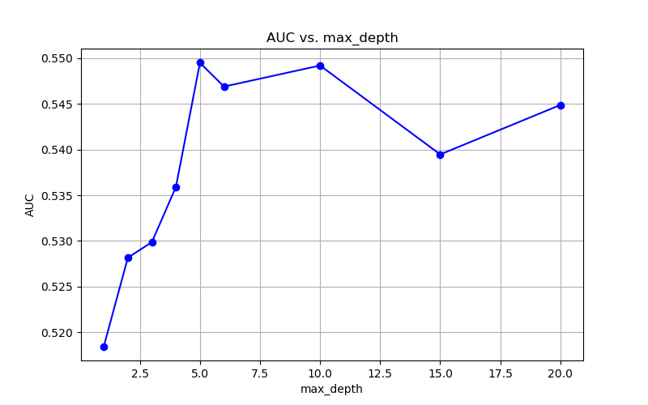
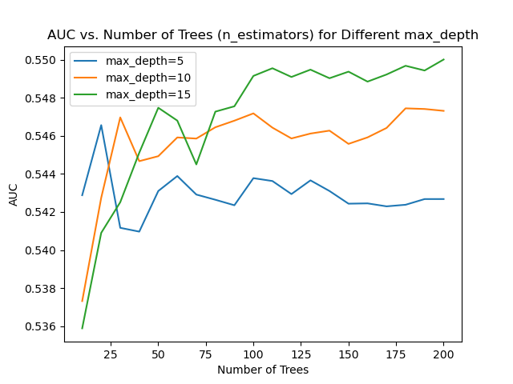
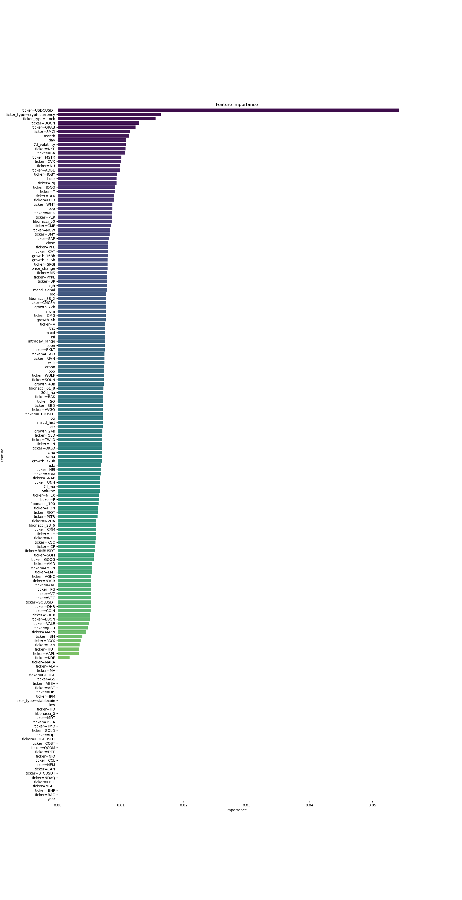

**Overview**

This project aims to explore the volatility of stablecoins, specifically USDC/USDT, in a dynamic market. With the rise of stablecoins and their importance in decentralized finance, understanding their price behavior is crucial for investors and market participants. The goal is to predict positive price growth (target variable, y) using advanced machine learning techniques, providing valuable insights that can help market participants make informed decisions in a volatile environment

The repository contains Python scripts for fetching, processing, and saving cryptocurrency and stock market data. It uses APIs (Binance for crypto, Yahoo Finance for stocks) to retrieve hourly data, enrich it with calculated metrics, and export the data as CSV files for analysis.

The project includes models such as Logistic Regression (LR), Decision Trees (DT), Random Forest (RF), and XGBoost.

```bash
stable_coin/  
├── images/                                     # Contains the images that are generated through EDA     
│   ├── boxplot_usdc.png      
│   ├── price_change_over_time.png      
│   ├── price_change_correlation_with_volume.png      
│   ├── distribution_price_change.png      
├── README.md                      
├── notebook.ipynb/       
│   ├── get_coins                               # Fetches and processes cryptocurrency data     
│   ├── get_stocks                              # Fetches and processes stock data      
│   ├── feature engineering                     # Adds derived metrics for ML models      
│   ├── model evaluation and tuning             # Compares models and saves the best as a pickle file      
├── train.py                                    # Trains the best model            
├── predict.py                                  # Flask application for making predictions       
├── requirements.txt                            # List of required Python packages       
├── environment.yml                             # Conda environment file     
├── LICENSE      
├── Dockerfile                                  # For containerized deployment    
```

## Data Exploration:


**Key Findings Matrix Correlation Stablecoin:**    
1. A strong positive correlation (`0.97`) exists between `open` and `close` prices, highlighting low intraday volatility.    
2. `price_change` and `growth_1h` exhibit a strong negative correlation (`-0.82`), suggesting inverse relationships between these metrics.      
3. Moderate correlation (`0.76`) between `volume` and `intraday_range` indicates that higher trading volumes are associated with larger intraday price movements.    
4. `7d_volatility` shows weak correlations with most features, indicating its independence from short-term trading metrics.   

        


**Boxplot for Closing Prices for USDC** 

To better understand the data distribution and identify potential outliers, a boxplot of the closing prices for USDC was generated:

   
         

Key observations:       
USDC prices mostly stay close to 1, indicating good stability as a stablecoin.
Outliers around 0.999 and 1.001 could be caused by short-term market fluctuations or external events.
The narrow Interquartile Range (IQR) shows minimal price fluctuations, suggesting consistent trading.
Outlier Clusters:

Outliers appear in clusters, possibly due to market distortions or technical issues.
Consecutive outliers point to specific periods of market stress or external events, such as political factors (presidential election).


**Price Changes and its correlation with Volume for USDC** 

This histogram shows the distribution of price changes for USDC, highlighting the frequency of different price change values over the dataset.

 
            
Key observations:        
The scatter plot shows the relationship between price change and trading volume for USDC/USDT. Most price changes are centered around 0, indicating stable behavior, even with varying volumes.  
There is a notable outlier with very high volume (~4e8) and a significant price change (~0.08). No clear linear correlation between volume and price change is observed, suggesting external factors might influence price deviations more than volume alone.

**Distribution of Price Change for USDC** 

      
        
Key observations:    
Most price changes are concentrated around 0, indicating that USDC's price remains stable, as expected for a stablecoin. The high frequency of 0 price changes confirms minimal fluctuations for USDC in most cases. Symmetric distribution: Price changes are evenly spread on both sides, showing that deviations (positive and negative) are rare and balanced. Outliers: Smaller bars farther from 0 represent rare, larger price changes, which are atypical.  
This validates USDC's stability for that time frame. The rare outliers might be caused by extreme market events or technical issues.


**Datasets**     
Stablecoin Data:
[Link to Cryptocurrencies Dataset](https://drive.google.com/file/d/18IzkQYiodTNiIxmnG7lGrrdb-akB0C-l/view?usp=sharing)

Stock Data:
[Link to Stocks Dataset](https://drive.google.com/file/d/1d4PRGApTcuQaCAj16dOc9k79P3M2PaYF/view?usp=sharing)

Merged Data with Features:
[Link to merged Dataset](https://drive.google.com/file/d/1aImaDFQWnDEN1wliP5KTh2MwfqFSktEi/view?usp=sharing)


**Features**

Crypto Data Fetcher: Retrieves OHLC data for selected cryptocurrencies and stablecoins using the Binance API, with additional derived metrics and timezone conversion.
Stock Data Fetcher: Fetches hourly stock data for predefined tickers using Yahoo Finance, enriching the data with calculated metrics.
USDC/USDT Analysis: Focuses on analyzing the stablecoin USDC/USDT, examining factors influencing its price growth, and using machine learning models to predict positive growth (y).
Machine Learning Models: Implements models like Logistic Regression (LR), Decision Trees (DT), Random Forest (RF), and XGBoost to predict price trends and growth of USDC/USDT.
Flask API: A Flask-based API is included to interact with the data programmatically (optional, for deployment).
Docker Support: A Dockerfile is provided for easy deployment in containerized environments.

### Machine Learning Models
The project employs various machine learning models to predict the one-hour price growth of USDC/USDT. The pipeline includes:

Feature Engineering: Derived metrics such as moving averages (7d, 30d), volatility, technical indicators (e.g., RSI, MACD), and others.

Models:

Logistic Regression (LR)    
   
Feature Analysis:   
The most impactful features based on accuracy changes:   
30d_ma (+2.13%)   
macd_hist (+1.09%)   
mom (+0.95%)   
open (+1.42%)   
Observations:    
Certain tickers (e.g., HEI, KGC, COIN) slightly improve model accuracy, each contributing a +0.0067 difference.
The tickers HEI (aerospace/defense), KGC (gold mining), and COIN (crypto exchange) impact model accuracy. Their relevance likely stems from macroeconomic ties to stablecoin behavior: HEI reflects economic trends, KGC aligns with safe-haven dynamics, and COIN directly links to the crypto sector.    
  
The model struggles to predict Class 1 (minority class), as reflected by low recall and F1-scores.
Feature engineering shows that moving averages (30d_ma) and momentum indicators (macd_hist, mom) significantly contribute to model performance.   
   
Decision Trees (DT)   
       
Validation Set Performance:   
Accuracy: 53.0%  
ROC-AUC: 0.530  
Confusion Matrix:  
True Negatives: 2506, False Positives: 2167  
False Negatives: 2093, True Positives: 2298  
F1-Score: 0.52  
Key Observations:  
Optimal AUC achieved through regularization with high min_samples_leaf (500) and moderate tree depth (6). Overfitting observed with low min_samples_leaf values or very deep trees. Balanced precision and recall for both classes with improved generalization.


Random Forest (RF)  
    
Validation Set Performance:   
AUC: 0.56 (indicating slightly better-than-random performance).  
Marginal improvements observed as n_estimators increase, with diminishing returns beyond 150 trees.  
Key Observations:  
Lower min_samples_leaf (1-3) values lead to overfitting and poor generalization.
Higher min_samples_leaf (≥50) oversimplifies the model, reducing performance.
Moderate max_depth (10) avoids overfitting while capturing relevant patterns.
The model achieves optimal performance by balancing flexibility (min_samples_leaf = 5) with ensemble size.   


XGBoost     
    
Evaluation:  
Time-based features (month, day, hour) suggest the model leverages seasonal patterns. Volatility indicates the model uses market fluctuations for predictions.  
Stock tickers such as DOCN (DigitalOcean), GRAB (Grab Holdings), and SMCI (Super Micro Computer) highlight a connection between traditional finance and crypto.  
DOCN: As a cloud infrastructure company, its stock volatility or market sentiment could reflect broader financial trends influencing crypto markets.
GRAB: A Southeast Asian tech company, its market performance may signal regional economic trends affecting investor sentiment, including in crypto.
SMCI: Specializing in high-performance computing, its stock could correlate with tech market trends, influencing investor confidence and risk sentiment in both traditional and crypto markets.  


### Installation
1. Clone the repository
bash
git clone https://github.com/your-repo.git
cd your-repo
2. Set up the environment
Using Conda:
bash
conda env create -f environment.yml
conda activate your-environment-name
Using pip:
bash
pip install -r requirements.txt

### How to Use
- Jupyter Notebook (notebook.ipynb):
Fetch cryptocurrency and stock market data:
Fetches data for cryptocurrencies and stablecoins defined in the coins list.
Processes the data and adds derived metrics (e.g., price change).
Saves the final dataset as stable_coins.csv.
Fetches hourly stock data for predefined tickers, adds derived metrics, and formats timestamps.
Combines all stock data into a single DataFrame and saves it as a CSV.
Logs missing or delisted stocks/cryptos as warnings or errors.
Perform feature engineering and derive metrics.
Evaluate multiple machine learning models.
Save the best models as .pkl files.
Train the Model:
Use train.py to train the best-performing model (default: XGBoost) on the processed data.
Save the trained model as a .pkl file.
Deploy the Model with Flask:
Use predict.py to deploy the model and provide predictions via a Flask API.

### Flask API
The repository includes a Flask API (`predict.py`) to interact with the trained XGBoost model. The API allows users to predict whether the price of USDC/USDT will grow positively within the next hour.

#### Steps to Use
1. **Start the Flask Server**  
   Ensure the conda environment is active and run:
   ```bash
   python predict.py
The API will start locally at http://0.0.0.0:8000.

2. **Make Predictions**
Send an HTTP POST request with the input features as JSON to the /predict endpoint.
EInput Example:
{
    "30d_ma": 102.5,
    "7d_ma": 101.0,
    "ticker=BTCUSDT": 1,
    "ticker=AAPL": 0
}

Output Example:
{
    "is_positive_growth_1h_future_probability": 0.67,
    "is_positive_growth_1h_future": true
}


### Run with Docker
To simplify deployment, a Dockerfile is provided. To build and run the Docker container:

## Build the Docker image:
docker build -t crypto-stock-analysis .
Run the container:
docker run -p 5000:5000 crypto-stock-analysis


License
This project is open-source and licensed under the MIT License.